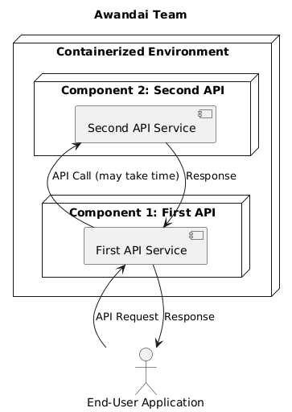

# API 1: Go Service




## Go installation on development machine

See instruction at https://go.dev/doc/install

Check go version installed.
```
go version
go version go1.15.7 darwin/amd64
```


## Middleware Recipe

https://gowebexamples.com/basic-middleware/


## Simple Middleware

```
go run main.go
```

Test 1:
```
curl 127.0.0.1:8001/v1
404 page not found
```

Test 2:
```
curl 127.0.0.1:8001/v1/foo
foo
```

Test 3:
```
curl http://localhost:8001/v1/call-api2
{
        "api1_message": "Hello from API1 (Go)",
        "api2_response": {"message":"Hello from API2","status":"ok"},
        "timestamp": "2025-07-19T05:16:13Z"
}                                
```

### Packages for Request Logging

```
go get gopkg.in/natefinch/lumberjack.v2
```


