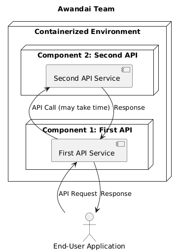

# Systen Architecture

### Diagram

@startuml
title Awandai Team

node "Containerized Environment" {
    node "Component 1: First API" as FirstAPI {
        [First API Service]
    }

    node "Component 2: Second API" as SecondAPI {
        [Second API Service]
    }
}

actor "End-User Application" as User

User -> [First API Service] : API Request
[First API Service] -> [Second API Service] : API Call (may take time)
[Second API Service] --> [First API Service] : Response
[First API Service] --> User : Response

@enduml

